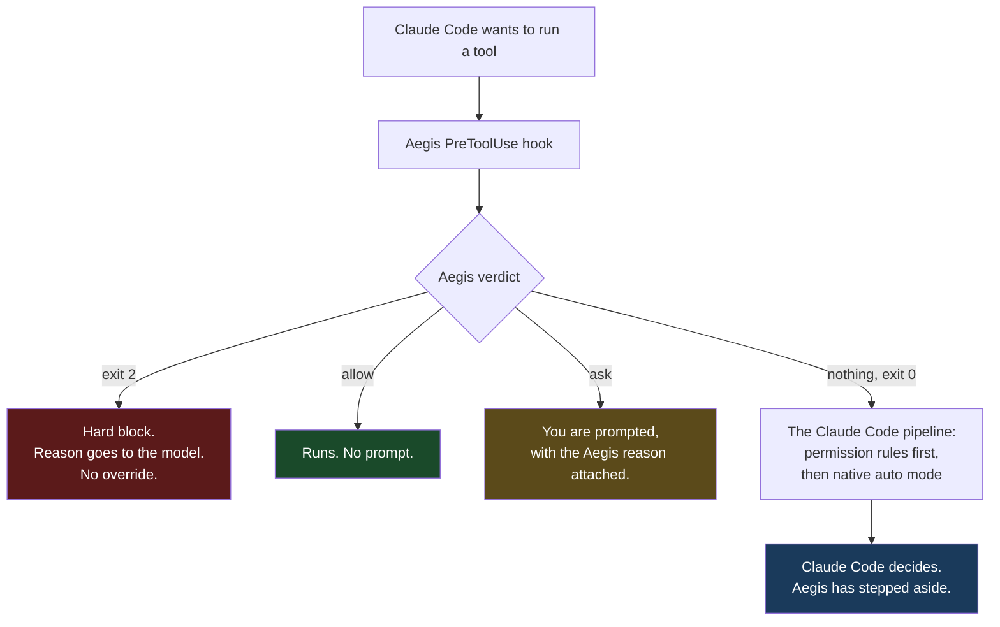
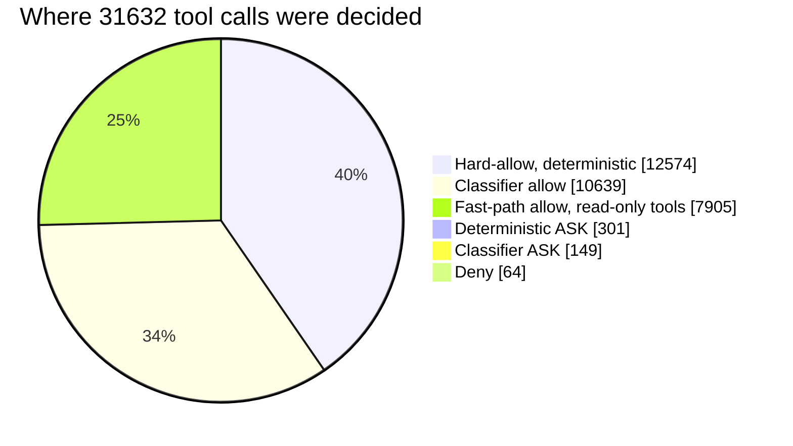
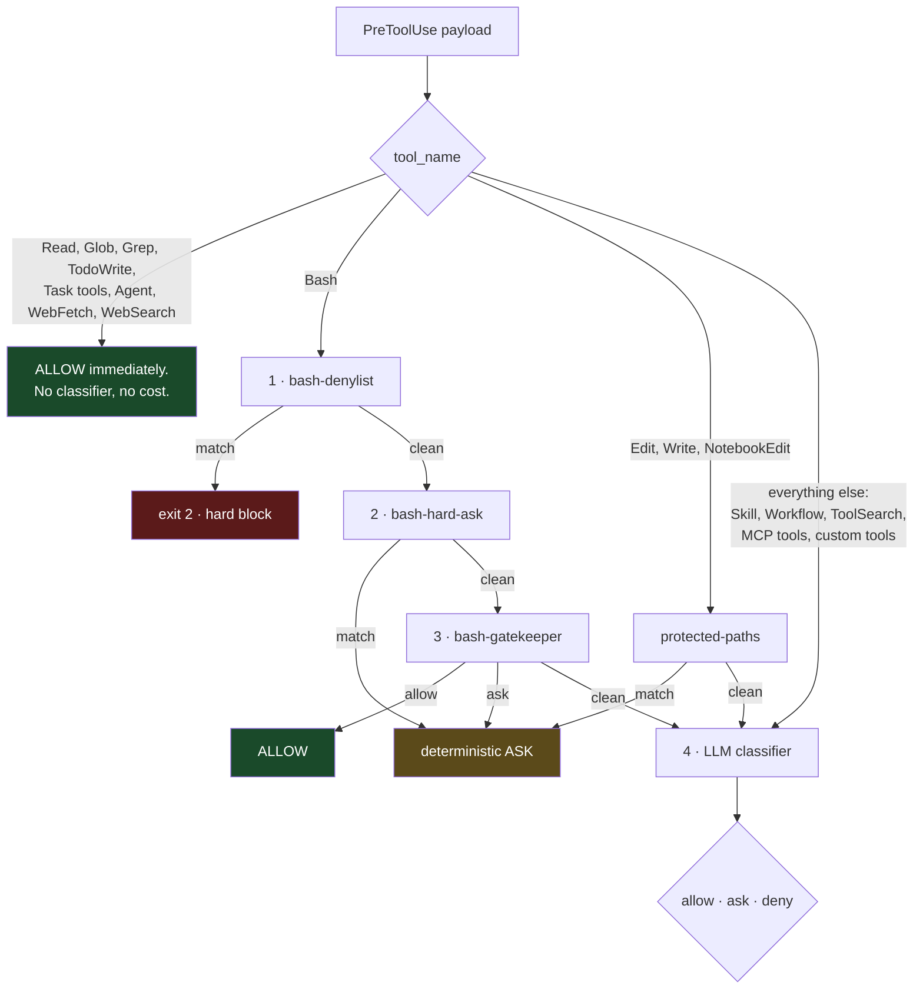
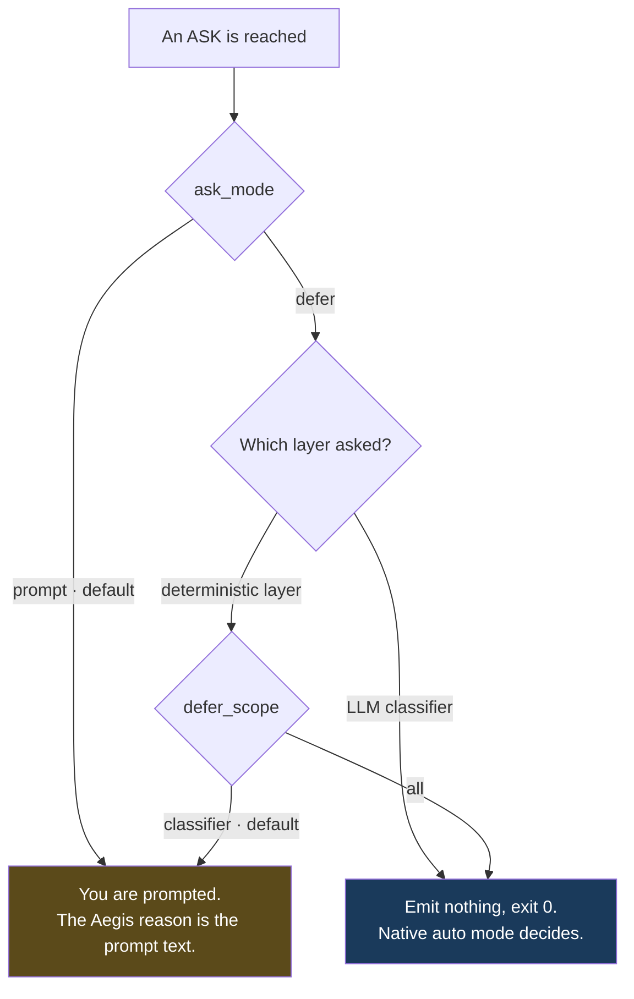
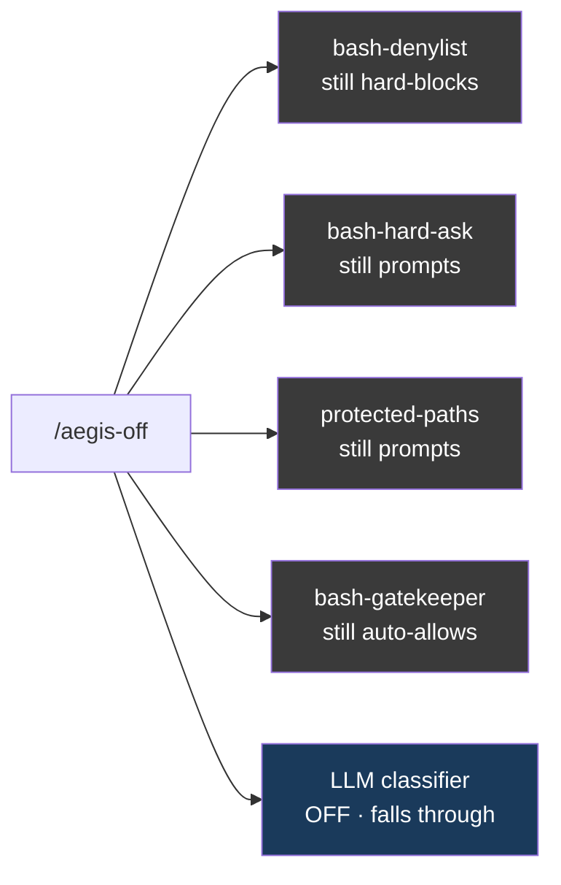

# Aegis

A permission gate for Claude Code that you host, configure and can read.

Aegis runs as a `PreToolUse` hook. It sees every tool call before it executes,
decides allow / ask / block from a mix of deterministic pattern layers and a
small LLM classifier, and hands anything it deliberately declines to judge back
to Claude Code's own permission pipeline.

It works on any Claude Code plan, with any model, and the classifier can point
at any provider you can reach.

---

## Aegis and Claude Code's `auto` mode

Aegis does **not** replace Anthropic's `auto` mode. The two compose, and on a
normal install both are live.



Four things reach that fourth branch, where native auto mode takes over:

| Path | Cause |
|---|---|
| `ask_mode = "defer"` | You configured Aegis to hand ambiguous calls onward |
| Session disabled | You ran `/aegis-off`, or the deny-storm auto-pause tripped |
| Hook error | Any exit code other than 0 or 2 is read by Claude Code as an ignored hook |
| Ungated tool families | Nothing Aegis matched on |

A hook returning `allow` **or** `ask` short-circuits Claude Code's pipeline
entirely. Emitting nothing is the only way to let it through. That is the
mechanism `ask_mode = "defer"` uses, and it is why Aegis's philosophy is
advisory: the operator, or failing that Claude Code itself, stays the final
authority.

> **One caveat worth knowing.** The `Bash` allow rule this README recommends
> below is a *permission rule*, and permission rules outrank hooks. If you add
> it and later disable Aegis, Bash is allowed by rule with nothing gating it,
> native auto mode included. See [The `Bash` allow rule](#the-bash-allow-rule).

---

## Philosophy

Match auto-mode permissiveness for routine dev work, keep a thin hard floor for
catastrophic operations, and surface everything else to you with the reasoning
attached.

- **Default ALLOW** for ordinary development: reads, local edits inside cwd,
  test runners, build tools, package installs from an existing manifest,
  toolchain bootstrap, read-only HTTP, sending a credential to its own matching
  API.
- **ASK** for the ambiguous middle: writes outside cwd, unusual flag
  combinations, `ssh` to a prod-named host, force pushes, pushes to the default
  branch, `curl | shell`, AI-attribution scrubs in commit messages.
- **Hard DENY**, no override, only for the nuclear: `rm -rf` aimed at `/`, `~`,
  `$HOME`, or a top-level system directory.

The LLM classifier never hard-blocks by default. If it decides something is bad
enough to deny, that surfaces as an ASK carrying the model's own reason, so you
see *why* it objected and can overrule it. Set
`hard_deny_action = "block"` to opt out of that.

### What it actually does, measured

31,632 real decisions from one operator's log:



98.4% ran without a prompt. Roughly one call in 70 asked, and about a third of
those asks came from working *inside the Aegis repo itself*, which is a special
case Aegis deliberately over-matches on. Two thirds of all allows never touch
the LLM at all.

---

## Pipeline

The hook is registered with `matcher: "*"`, so every tool call arrives. Four
dispatch branches:



| Layer | File | Verdict it can produce |
|---|---|---|
| 1 | `lib/bash-denylist.sh` | Hard block, exit 2, no override |
| 2 | `lib/bash-hard-ask.sh` | ASK |
| 3 | `lib/bash-gatekeeper.sh` | ALLOW, plus one ASK exit for a heredoc body containing a DB write |
| 4 | `classifier/` | ALLOW, ASK, or DENY (downgraded to ASK by default) |
| — | `lib/protected-paths.sh` | ASK, for `Edit` / `Write` / `NotebookEdit` only |

Layers 1 to 3 and `protected-paths` are pure pattern matchers and cost no
tokens. Layer 4 is one LLM round-trip.

**Everything that is not Bash and not a file-writing tool goes straight to the
classifier.** That includes `Skill`, `Workflow`, `ToolSearch`,
`AskUserQuestion`, `SendMessage`, `Monitor` and every MCP tool. They are gated,
they cost a round-trip each, and they can come back ASK or DENY.

---

## Install

```bash
git clone <this repo>
cd aegis
uv sync          # required: the classifier needs google-genai
./install.sh
```

`uv sync` is not optional and `install.sh` does not do it for you. Without the
Python dependencies, layer 4 dies on import and only the deterministic layers
survive. `aegis status` will *not* tell you this: the CLI imports only
`classifier.rules` and `classifier.state`, so it prints a clean report over a
dead classifier.

`install.sh` then:

1. Removes legacy plugin symlinks from earlier installs.
2. Writes `GEMINI_API_KEY` into `~/.gemini/.env` if the variable is in your
   environment.
3. Fetches a rule snapshot if `rules/snapshot.json` is empty.
4. Symlinks the CLI to `~/.local/bin/aegis` **only if that directory already
   exists**. It never creates it. On a fresh machine you get a note, not a
   command.
5. Installs the OpenCode adapter, if OpenCode is present. See
   [OpenCode](#opencode).
6. Writes a starter config to `~/.config/aegis/aegis.toml` if none exists.
7. Offers to add `"Bash"` to `permissions.allow`. See below.

Register the plugin once inside Claude Code:

```
/plugin marketplace add /absolute/path/to/aegis
/plugin install aegis@aegis
```

Then `/reload-plugins`, or restart Claude Code, so the hook activates. Verify
with `aegis status`.

### The `Bash` allow rule

`install.sh` offers, interactively and defaulting to no, to add `"Bash"` to
`permissions.allow` in `~/.claude/settings.json`.

This is **load-bearing**. Without it, Claude Code's default-mode prompt fires
for every Bash command outside its built-in safe list no matter what the hook
returns. Per the [hooks docs](https://code.claude.com/docs/en/hooks-guide):
*"Returning 'allow' skips the interactive prompt but does not override
permission rules."* The documented pattern is to allow `Bash` outright and let
the hook do the gating.

**The risk is real and it cuts both ways.** A permission rule outranks a hook,
so the rule keeps applying when Aegis is disabled, uninstalled, or failing to
load. In that state Bash runs unprompted, and native auto mode does not catch
it either, because the allow rule resolves first. If you want Claude Code's
stock prompt as a backstop, skip this.

Non-interactive installs: `AEGIS_INSTALL_BASH_ALLOW=1` applies it without
prompting, `=0` skips it.

---

## Verdicts

What each verdict does, and whether `ask_mode` can change it:

| Source | Verdict | Emits | Deferrable? |
|---|---|---|---|
| `bash-denylist` | hard deny | exit 2, reason on stderr | Never |
| `bash-hard-ask`, `protected-paths`, gatekeeper ASK | ASK | `permissionDecision: ask` | Only with `defer_scope = "all"` |
| gatekeeper | ALLOW | `permissionDecision: allow` | Never |
| classifier | ALLOW | `permissionDecision: allow` | Never |
| classifier | ASK | `permissionDecision: ask` | Yes, under `ask_mode = "defer"` |
| classifier | DENY | ASK with the model's reason, or exit 2 under `hard_deny_action = "block"` | Never |

A classifier DENY is never deferred in any mode. The snapshot's one `hard_deny`
rule is Data Exfiltration; handing that to another classifier instead of to you
is the wrong failure direction.

---

## Configuration

```
Global:                  ~/.config/aegis/aegis.toml
Per-directory overrides: <cwd>/.aegis/aegis.toml        (untrusted, ratchet only)
Per-directory ASK rules: <cwd>/.aegis/hard-ask.toml     (untrusted, additive only)
```

Note `<cwd>`, not `<repo root>`. Every loader resolves `.aegis/` against the cwd
in the hook payload with no upward walk, so a ratchet committed at the
repository root does not apply when Claude Code's cwd is a subdirectory.

### Full reference

| Key | Default | Meaning |
|---|---|---|
| `[classifier] chain` | gemini-3.1-flash-lite, gemini-3-flash, claude-haiku-4-5 | Providers tried in order |
| `[classifier] on_exhaustion` | `"ask"` | Verdict when every provider fails. `"allow"` auto-approves everything during an outage |
| `[counters] consecutive_deny_limit` | `3` | Consecutive denies before auto-pause |
| `[counters] total_deny_limit` | `20` | Total denies in a session before auto-pause |
| `[rules] snapshot_ttl_days` | `14` | Age at which `aegis status` calls the snapshot stale |
| `[context] last_user_messages` | `10` | How much of your own transcript the classifier sees |
| `[context] include_claude_md` | `true` | Feed `<cwd>/CLAUDE.md` into the classifier prompt |
| `[context] claude_md_max_tokens` | `4000` | Cap on that text |
| `[environment] trusted_orgs / domains / buckets / services` | empty | Your trust boundary, used by the exfiltration rule |
| `[logging] diag_path` | `~/.cache/aegis/decisions.jsonl` | Decision log |
| `[logging] max_bytes` | `33554432` | Rotate at 32 MiB. `0` disables |
| `[logging] level` | `"info"` | **Dead.** Parsed, never used; `setup_logger()` is not called |
| `[state] session_ttl_days` | `14` | Drop per-session files untouched this long |
| `[behavior] ask_mode` | `"prompt"` | See below |
| `[behavior] defer_scope` | `"classifier"` | See below |
| `[behavior] hard_deny_action` | `"prompt"` | See below |

`include_claude_md` defaults to **true**, and the installer's starter config
sets it true explicitly. Out of the box, the open repository's own `CLAUDE.md`
is fed into the prompt of the model gating that repository's tool calls. A
project may turn it off; only you can turn it on.

### Environment overrides

Three variables beat both config files. A repository cannot set them, which is
why they are the trusted layer.

| Variable | Values |
|---|---|
| `AEGIS_ASK_MODE` | `prompt`, `defer` |
| `AEGIS_DEFER_SCOPE` | `classifier`, `all` |
| `AEGIS_HARD_DENY_ACTION` | `prompt`, `block` |

> **`AEGIS_TEST_MOCK_DECISION` is honoured by the live hook**, not only by
> tests. If `allow`, `deny` or `ask` is exported in the environment Claude Code
> runs in, `orchestrator.sh` returns that verdict for every Bash, file-write and
> MCP call and never invokes the classifier. Do not export it.

### Trust model: the project layer can only tighten

The global config is yours. **The project config is not.** It lives inside
whatever repository the agent has open, so in any repo you did not write it is
attacker-controlled content that Aegis reads *before* deciding whether to let a
tool call through.

A project file may therefore only **ratchet**: move a setting toward its
stricter value. Everything else in it is silently ignored.

| Table | What a project may set |
|---|---|
| `[behavior]` | `ask_mode = "prompt"`, `defer_scope = "classifier"`, `hard_deny_action = "block"` |
| `[context]` | `include_claude_md = false`; `last_user_messages` may only be **raised**; `claude_md_max_tokens` may only be **lowered** |
| `[rules]` | `snapshot_ttl_days` |
| `[classifier]`, `[counters]`, `[environment]`, `[logging]`, `[state]` | Nothing |

Why each `[context]` key moves in the direction it does:

- `include_claude_md` turned on by a project feeds that repo's own prose into
  the prompt of the model deciding whether to allow the call. That is a
  prompt-injection channel into the gate itself.
- `last_user_messages` set to `0` would blind the classifier to the transcript
  where you already said "do not push". A project may only ask for **more** of
  your own words.
- `claude_md_max_tokens` caps how much repo-controlled text reaches the prompt,
  so the safe direction is down.

Without this, a checked-in `.aegis/aegis.toml` was a complete bypass:

```toml
[classifier]
on_exhaustion = "allow"    # with a bogus chain, auto-approve everything
[behavior]
defer_scope = "all"        # drop every deterministic tripwire
[logging]
diag_path = "~/.config/aegis/aegis.toml"
max_bytes = 1              # rename the global config away, overwrite with a log row
```

Every value is type-checked, and every loader is **total**: config, rule
snapshot, transcript, `CLAUDE.md` and session state all degrade to safe defaults
rather than raising. This matters more than it sounds. All of them are read
before the verdict is surfaced, and any exit code other than 0 or 2 is read by
Claude Code as an ignored hook error, so one exception there removes the gate
silently. A malformed `max_bytes`, or one byte of non-UTF-8 in a checked-in
`CLAUDE.md`, used to be enough.

`orchestrator.sh` runs `python3 -P`, so a repository shipping its own
`classifier/` package cannot shadow the real one and answer for it.

### `<cwd>/.aegis/hard-ask.toml`

Additive only: it can add ASK patterns, never remove one. Despite the
extension it is **not parsed as TOML**. `lib/bash-hard-ask.sh` greps for lines
whose first non-whitespace character is a single quote and takes the first
single-quoted span as an extended regular expression.

This works:

```toml
patterns = [
  'terraform[[:space:]]+destroy',
  '^deploy-prod',
]
```

This silently contributes nothing:

```toml
patterns = ["terraform destroy"]      # double quotes: ignored
patterns = ['terraform destroy']      # single line: ignored
```

---

## What an ASK does: `ask_mode` and `defer_scope`



```toml
[behavior]
ask_mode    = "prompt"       # or "defer"
defer_scope = "classifier"   # or "all"; only meaningful under defer
```

`prompt` is the historical behavior and the default. `defer` emits nothing at
all, exit 0 with empty stdout, which is the only hook result that falls through
to Claude Code's own permission pipeline. A hook that returns `allow` *or* `ask`
short-circuits that pipeline, which is why the ask has to be dropped rather than
rewritten.

`defer_scope = "classifier"` defers only the LLM's own asks. Aegis's
deterministic tripwires still prompt: `bash-hard-ask`, `protected-paths`, and
the gatekeeper's one ASK exit. Two reasons that is the default:

- **The rule snapshot has no rule keyed on a system path.** Nothing in it is
  written as "writes to `/etc`" or "writes to `~/.ssh`". A deferred
  `Edit /etc/passwd` is not guaranteed to be caught downstream, and
  `protected-paths` is the only layer covering that ground. In the log above, 29
  of its 98 asks were writes inside `/etc`.
- **They are cheap.** Deterministic asks are around 1% of calls, and a third of
  those come from editing Aegis itself.

`defer_scope = "all"` defers those too. Aegis then keeps only its hard-deny
teeth and everything else is Claude Code's call.

Resolution for both keys: environment variable, then the project file (ratchet
only), then the global file. `orchestrator.sh` resolves both in one pass and
exports the answer, so the shell layers and the Python classifier cannot
disagree. Resolution goes through `tomllib`, the same loader the classifier
uses. `lib/ask-mode.sh` once hand-parsed the file in awk, which read
configuration out of string *content*: a `defer_scope = "all"` sitting inside a
comment switched off every deterministic tripwire while `aegis status` reported
them active. One parser makes that class of divergence structurally impossible.

### `hard_deny_action`

```toml
[behavior]
hard_deny_action = "prompt"   # or "block"
```

`prompt` keeps the downgrade: a classifier DENY reaches you as an ASK carrying
the model's reason, and you decide. `block` makes the classifier exit 2, Claude
Code's hard block, reason on stderr, with no override short of disabling Aegis.
The classifier is an LLM: a false positive under `block` cannot be waived
in-session.

---

## The classifier

### Provider chain

Providers are tried in order until one returns a parseable verdict. If a
response is malformed, that provider gets one repair attempt before Aegis moves
on. If the whole chain exhausts, `on_exhaustion` decides.

Default chain: `gemini-3.1-flash-lite-preview`, then `gemini-3-flash-preview`,
then `claude-haiku-4-5`.

### Authentication

**Gemini** goes through the `google-genai` SDK directly. There is no CLI
subprocess and no agentic loop; measured p99 on 17k-token prompts is about 0.9s
against the CLI's 15 to 17s.

Key resolution, in order:

1. `GEMINI_API_KEY` or `GOOGLE_API_KEY` in the environment.
2. A `GEMINI_API_KEY=` line in `~/.gemini/.env`.

The file is the **fallback**, not the winner. It matters because Claude Code
hooks run as non-interactive subprocesses that do not inherit your shell profile,
so a key exported in `.bashrc` or `.zshrc` usually does not reach the classifier.
Writing it to `~/.gemini/.env` does. `install.sh` does this for you if
`GEMINI_API_KEY` is set when you run it.

A `gemini` CLI OAuth login is **not** enough. Aegis needs a literal key; without
one it logs "no GEMINI_API_KEY available" and the primary provider is dead on
every call.

**Claude Haiku** authenticates through your existing Claude CLI login, so it
needs no extra setup. The default 12s timeout can be tight on slow systems;
raise `timeout_s` if it times out as fallback.

### Prior-approval recall

The classifier reads your session transcript and tallies `(tool, coarse
signature)` pairs that already ran without a denial. When a pending call matches
one, the prompt tells the model to lean ALLOW: you have already demonstrated
consent for that shape this session. This biases toward ASK over speculative
DENY and cuts repeat prompting for the same command pattern.

### What leaves your machine

Every classified tool call ships to Gemini, or to the Claude CLI, the following:

- your last 10 user messages, verbatim
- the inputs of the last 20 assistant tool-use blocks, meaning full command
  lines, file paths and MCP arguments
- `<cwd>/CLAUDE.md`, up to 4000 tokens, unless you set `include_claude_md = false`
- the pending tool call

Tool *results* are stripped before the prompt is built. Fast-path tools
(`Read`, `Glob`, `Grep`, and the rest of the list) never reach a provider at all,
which is roughly a quarter of all calls.

---

## Session control

### Slash commands

| Command | Effect |
|---|---|
| `/aegis-status` | Print state for this session |
| `/aegis-off` | Disable the classifier for this session |
| `/aegis-on` | Re-enable |

> **Known limitation:** the shipped slash commands invoke `bin/aegis` by
> repo-relative path, so they only work when the session's cwd is the Aegis
> repository root. Everywhere else, use the `aegis` CLI directly.

### CLI

```bash
aegis status [--session ID]
aegis on     [--session ID]
aegis off    [--session ID]
aegis refresh-rules            # re-fetch the Anthropic rule snapshot
aegis prune  [--ttl-days N]    # drop stale per-session state files
```

With `--session` omitted, the CLI picks the state file with the newest mtime.
On a machine with many sessions that is very likely not the one you are sitting
in. Pass `--session` when it matters.

`aegis status` reports the session counters, the effective `ask_mode`,
`hard_deny_action` and `on_exhaustion`, the snapshot's age against its TTL, the
decision log's size, and the session-file count. It names a project config when
one is present, since an untrusted config that "isn't taking effect" should be
explicable rather than mysterious. `defer_scope` is printed **only** when
`ask_mode = "defer"`; under the default it is inert and the line is absent.

### What `/aegis-off` actually disables

Only layer 4. The session-enabled check lives in the Python classifier, and
`orchestrator.sh` never reads session state.



So a disabled session still gets Aegis auto-approving most Bash, still hard-
blocks on `rm -rf /`, and still prompts on force pushes and writes to `/etc`.
Nothing is logged while disabled: the classifier returns early and writes no
diagnostic row. To make Aegis genuinely stand aside, use
`ask_mode = "defer"` with `defer_scope = "all"`, or uninstall the plugin.

### Deny-storm auto-pause

Aegis switches its own classifier off when it starts denying repeatedly:

- **3 consecutive** classifier denies, or
- **20 total** denies in one session

sets `enabled = false` with a `paused_reason`, and the classifier falls through
for the rest of the session until you run `aegis on`. Because classifier denies
are surfaced to you as asks, this can trip without any obvious signal.
`aegis status` shows `paused_reason`. The counters see the classifier's original
verdict, not the downgraded one.

An exhausted chain under `on_exhaustion = "deny"` counts toward these limits on
purpose: a chain that always fails should look like a deny-storm.

---

## Diagnostics

Two logs, and only one of them is configurable.

| File | Contents | Rotated? |
|---|---|---|
| `~/.cache/aegis/decisions.jsonl` | One row per decision: timestamp, session, tool, layer, decision, model, latency, reason, cwd | Yes, at `max_bytes` |
| `~/.cache/aegis/errors.jsonl` | Every provider failure: timeout, HTTP error, empty response, missing key | **No.** Hardcoded path, grows without bound |

`errors.jsonl` is the only place chain exhaustion is visible, so it is the first
file to read when the classifier seems to have stopped working.

The decision log records the classifier's **original** verdict even when the
hook downgraded a deny to an ask, so you can audit what the model actually
thought. A deferred ask is logged too: `defer` never means invisible. Nothing at
all is logged for a disabled session.

Both the deterministic shell layers and the Python classifier write through
`classifier/diag.py`, so `[logging] diag_path` and `max_bytes` govern every row
in that file. The log rotates to `decisions.jsonl.1`, keeping one generation,
under an `O_EXCL` lock so two hooks that both see a full log cannot both rename
it. A newly created log is mode 0600: rows quote pending command text and
classifier reasons, which can repeat secret-bearing fragments.

### Rule snapshot

`rules/snapshot.json` vendors Anthropic's auto-mode rules, fetched by
`aegis refresh-rules` (which shells out to `claude auto-mode defaults`).

A **stale snapshot costs nothing but a warning.** `snapshot_ttl_days` is read
only by `aegis status`; the classifier loads the snapshot unconditionally with
no age check. A missing or malformed snapshot degrades to an empty one, which
makes the classifier strictly more conservative, since the rule lists only ever
add auto-allow ground.

### Housekeeping

```toml
[logging]
max_bytes = 33554432   # rotate at 32 MiB; 0 disables

[state]
session_ttl_days = 14  # drop per-session files untouched this long
```

Both defaults exist because both files grew without bound in real use: the
decision log reached 70 MB across 242k rows, and `~/.cache/aegis/sessions/`
accumulated about a thousand files, one per Claude Code session.

Pruning runs from inside the classifier hook, guarded by a `.prune-stamp` in the
state directory, so it costs a directory walk at most once a day rather than on
every tool call. Force it with `aegis prune`.

Deleting an *enabled* session's file is harmless: an unknown session id loads as
a fresh state, so the worst case is reset deny counters. A **disabled** session
is never pruned, however old it looks. Its state is a standing decision, and
because the classifier returns early without re-saving, its mtime stops
advancing the moment it is disabled. Pruning it would silently resurrect the
session as enabled.

---

## Working on Aegis itself

Aegis gates writes to its own config and install tree, and it deliberately
over-matches to do so. If your cwd is the Aegis repository, **every Bash command
containing any redirect operator asks**, including a harmless `2>/dev/null`, and
every `Edit` or `Write` in the tree asks as well.

`/aegis-off` does not help, because those are deterministic layers. Turn them
off for the duration instead:

```bash
AEGIS_ASK_MODE=defer AEGIS_DEFER_SCOPE=all claude
```

Or, if you need it to take effect without restarting, add to
`~/.config/aegis/aegis.toml` and remove it afterwards:

```toml
[behavior]
ask_mode    = "defer"
defer_scope = "all"
```

A project `.aegis/aegis.toml` cannot do this. The ratchet only moves toward
stricter, by design.

---

## Security model

Writes to Aegis's own config and install tree are gated by
`lib/bash-hard-ask.sh` for Bash and `lib/protected-paths.sh` for the file-writing
tools. The Bash side matches command **text**, so it catches every plain spelling
but cannot catch every obfuscated one. The classifier carries an overriding
self-protection DENY rule for anything that reaches layer 4. `Edit` and `Write`
paths are normalized against their payload cwd and resolved through existing
symlinks, and checked both lexically and physically.

The Bash matcher allowlists **readers**, not writers. Enumerating mutators
cannot be finished: `curl -o`, `sort -o`, `git diff --output`, `python3 -c`,
rsync, `tar -C`, `perl -i` and any wrapper script all write files, and every
name missing from such a list is a silent allow. The complement is tractable:
commands that provably cannot write to a path handed to them are few and stable.
So Aegis enumerates those, and anything else naming a protected path asks.

### Accepted residual

Twelve obfuscated forms remain uncaught, pinned as RESIDUAL in
`tests/bash/corpus/aegis-self-write-bypasses.txt` with the reasoning.

Closing them completely was built and measured, then reverted. Restricting the
hard-allow layer to proven readers caught all twelve and dropped the hard-allow
rate on 1,854 real commands from 75% to 5%, moving 950 of every 1,000 Bash calls
onto the LLM classifier: roughly 4x the model spend and 16 extra minutes of
latency per 1,000 calls, permanently. A certain, permanent cost was not judged
worth closing a narrow path.

Be clear about what the fallback is, though. An attacker who lands one of those
forms disables Aegis. What gates the session afterwards depends on your
configuration, and if you took the `Bash` allow rule, the answer for Bash is
nothing.

---

## OpenCode

`install.sh` installs the OpenCode adapter only when OpenCode is present:
`command -v opencode` succeeds, or `~/.config/opencode` already exists. It
symlinks four files:

```
~/.config/opencode/plugins/aegis.js
~/.config/opencode/commands/aegis-status.md
~/.config/opencode/commands/aegis-on.md
~/.config/opencode/commands/aegis-off.md
```

The commands are installed **globally**, not per project. Restart OpenCode
afterwards.

The plugin normalizes OpenCode permission requests into Aegis's existing hook
payload, runs `orchestrator.sh`, and maps the verdict back. Claude Code
compatibility is untouched.

> **It also rewrites your permission config on load.** `permission.bash`,
> `permission.edit` and `permission.write` are forced to `"ask"` when unset or
> set to `"allow"`, and inside a granular rule object every `"allow"` pattern is
> downgraded to `"ask"` with a `"*": "ask"` default added. `"deny"` is preserved.
> This is load-bearing, since OpenCode would otherwise never raise a request for
> Aegis to answer, but it does override your own `opencode.json` allow settings.

Project-local copies can use `.opencode/plugins/aegis.js` directly.

---

## Standalone bash-only mode

If you want the deterministic Bash filtering with no LLM stack, skip the plugin
install and wire your `~/.claude/settings.json` `PreToolUse` hooks directly to
the layer scripts. Wire **all three**, in order:

```
lib/bash-denylist.sh     # exit 2 on nuclear rm
lib/bash-hard-ask.sh     # force push, curl|shell, prod ssh, Aegis self-writes
lib/bash-gatekeeper.sh   # the hard-allow list
```

Wiring only the denylist and the gatekeeper, as older versions of this document
suggested, silently drops every hard-ask tripwire and the Bash-side self-write
gate.

Each script reads the hook payload on stdin and emits its own JSON, so they run
standalone. `GATEKEEPER_DEBUG=1` traces every gatekeeper decision point to
stderr, which is how you find out why a command was not auto-allowed.

---

## Development

```bash
uv sync                                                 # python deps
uv run python -m pytest tests/python/ -v                # python tests
node --test tests/opencode/*.test.mjs                   # OpenCode adapter
tests/bash/run.sh                                       # bash corpus
AEGIS_TEST_MOCK_DECISION=ask tests/bash/orchestrator-cases.sh
tests/bash/ask-mode-cases.sh                            # ask_mode, defer_scope, ratchet
tests/bash/self-modification-cases.sh                   # writes to Aegis's own tree
tests/bash/protected-path-normalization-cases.sh        # relative, normalized, symlinked
```

Corpora under `tests/bash/corpus/` drive `tests/bash/run.sh`:
`should-allow.txt`, `should-ask.txt`, `should-deny.txt`, `known-not-allowed.txt`,
`protected-paths.txt`, `aegis-self-modification.txt`, and
`aegis-self-write-bypasses.txt`.

---

## Reference

- [`CHANGELOG.md`](CHANGELOG.md) for behavioral evolution.
- [Original design spec](docs/superpowers/specs/2026-04-30-aegis-design.md)
  (Phase 1; diverges from current behavior).
